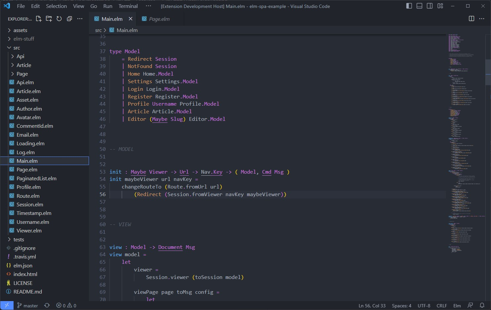
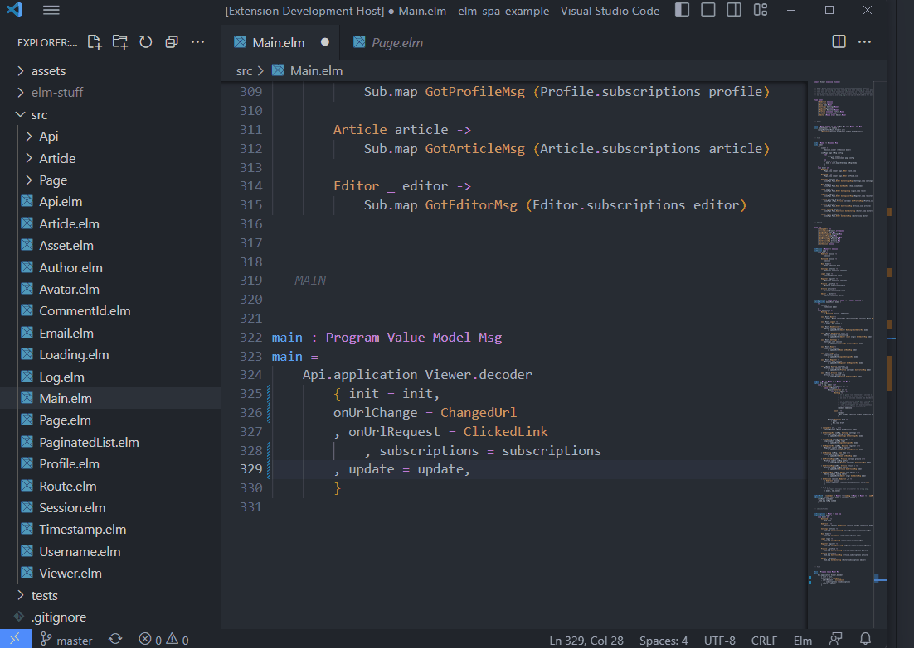
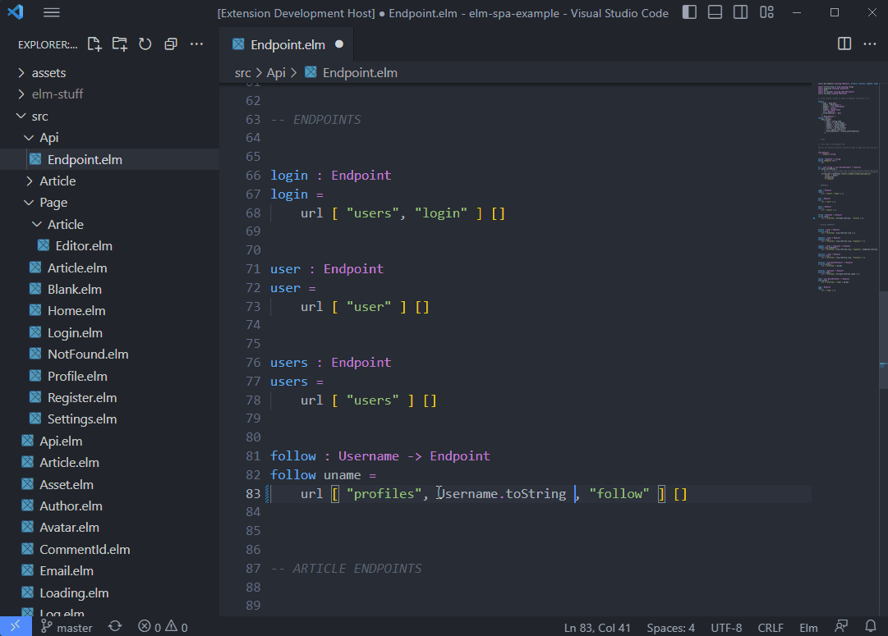
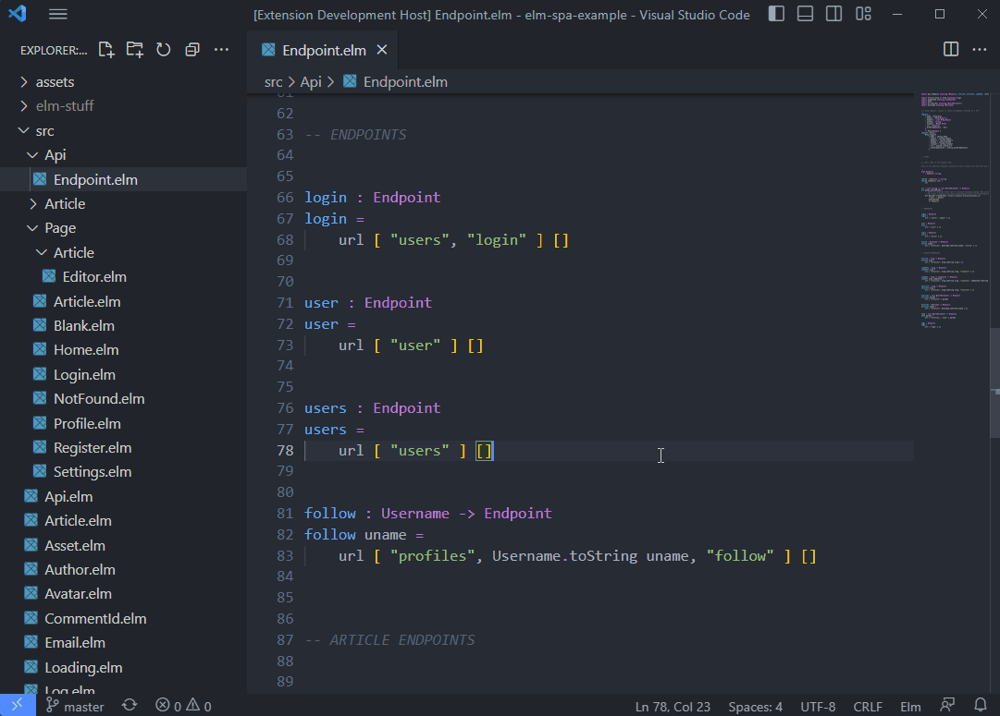
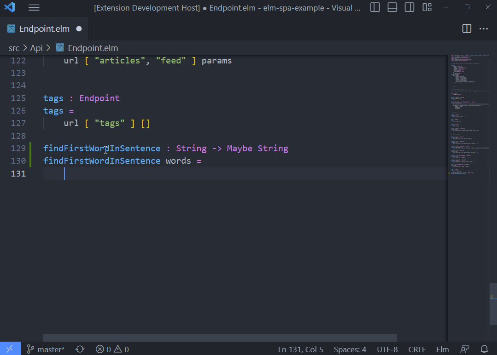
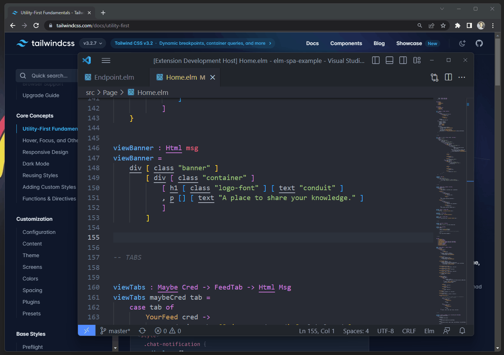

# Documentation
> Documentation for the Elm Land VS code plugin

### __Table of contents__

- 📚 [Features](#features)
  - [Syntax highlighting](#syntax-highlighting)
  - [Format on save](#format-on-save)
  - [Error highlighting](#error-highlighting)
  - [Jump-to-definition](#jump-to-definition)
  - [Offline package docs](#offline-package-docs)
  - [Module import autocomplete](#module-import-autocomplete)
  - [Convert HTML to Elm](#convert-html-to-elm)
- 📊 [Performance Table](#performance-table)
- 💖 [Thank you, Elm community](#thank-you-elm-community)
- 🛠️ [Want to contribute?](#want-to-contribute)

## __Features__

With the Elm Land plugin, every feature (except "Syntax highlighting") is fully optional. By default, all features are enabled. If you prefer a more minimal editing experience, you can disable any feature in your [VS Code "User Settings"](https://code.visualstudio.com/docs/getstarted/settings).

This section breaks down what each feature does, and the VS code configuration setting that enable/disable it.

---

### __Syntax highlighting__

__Setting:__ _None_ 

Provides basic [syntax highlighting](https://en.wikipedia.org/wiki/Syntax_highlighting) to help you visually scan your Elm code, increase readability, and provide context. This feature is the only one that cannot be disabled.

---

### __Format on save__

__Setting:__ `formatOnSave`

Uses [elm-format](https://github.com/avh4/elm-format) to automatically format your code on save. This requires the `elm-format` command to be installed on your computer, and the VS code plugin can take care of that for you if you already have [Node.js](https://nodejs.org/en/download/) installed.

---

### __Error highlighting__

__Setting:__ `elmLand.feature.errorHighlighting`

If your Elm code doesn't compile, this feature will underline the relevant problems in your editor. It depends on a local installation of `elm` on your computer.

When you open an Elm file, or save one, you'll see a red underline under each compiler error. 

__Note:__ The Elm Land plugin will also check the `elmLand.entrypointFilepaths` setting to compile the top-level Elm program. This allows the editor to report errors in other files. If your project doesn't use `src/Main.elm` as the program's entrypoint, change the `elmLand.entrypointFilepaths` settings in that workspace's `.vscode/settings.json` file. 

---

### __Jump to definition__

__Setting:__ `elmLand.feature.jumpToDefinition`

You can jump to the definition of any function or value, even if it's defined in another module. This is helpful for quickly navigating around.

---

### __Offline package docs__

__Setting:__ `elmLand.feature.offlinePackageDocs`

Every Elm package in the ecosystem comes with built-in documentation. With this feature, even if you're offline, you can access this documentation from within your editor.

---

### __Module import autocomplete__

__Setting:__ `elmLand.feature.autocomplete`

Every Elm module in your project, and any Elm package you installed will provide autocomplete information for the exposed types, functions, and values. To see more detailed documentation, you can even toggle details panel for each autocomplete suggestion.

---

### __Convert HTML to Elm__

__Setting:__ `elmLand.feature.htmlToElm`

To help you convert HTML snippets to Elm code and help newcomers learn the syntax of Elm, this plugin comes with a built-in "HTML to Elm" action whenever you highlight over a snippet of HTML code.

---

## __Performance Table__

Elm's [editor plugins repo](https://github.com/elm/editor-plugins) recommends doing performance profiling to help others learn how different editors implement features, and also to help try to think of ways to bring down costs.

This VS code plugin was specifically designed to have __near-zero memory overhead [¹](#low-memory-overhead)__, and to __avoid in-memory indexing__ that cache your codebase before invoking features. For this reason, it's been very effective at [Vendr](https://vendr.com), even though the frontend codebase is __over 400k lines__ of Elm code.

### __Massive Elm projects__ (578k lines of Elm)

These benchmarks were taken on a __MacBook Pro (2020) [²](#macbook-specs)__ testing this editor plugin against [Vendr](https://vendr.com)'s codebase, which has __578k lines of Elm code__ across 3,384 Elm files.

Feature | Average Speed | Constant RAM Overhead | Cumulative CPU Costs
:------ | :------------ | :-------------------- | :-------------------
__Format on save__ | <200ms | _None_ | On command
__Error highlighting__| <500ms | _None_ | On file open and save
__Jump-to-definition__ | <600ms | _None_ | On file open and save
__Offline package docs__ | <400ms | _None_ | On command
__Module import autocomplete__ | <100ms | _None_ | On key stroke
__Convert HTML to Elm__ | <100ms | _None_ | On command

### __Medium-size projects__ (3.8k lines of Elm)

These benchmarks were taken on a __Windows PC [³](#pc-specs)__ testing this editor plugin against [rtfeldman/elm-spa-example](https://github.com/rtfeldman/elm-spa-example) repository, which has __3.8k lines of Elm code__ across 34 files.

Feature | Average Speed | Constant RAM Overhead | Cumulative CPU Costs
:------ | :------------ | :-------------------- | :-------------------
__Format on save__ | <300ms | _None_ | On command
__Error highlighting__| <500ms | _None_ | On file open and save
__Jump-to-definition__ | <150ms | _None_ | On file open and save
__Offline package docs__ | <100ms | _None_ | On command
__Module import autocomplete__ | <100ms | _None_ | On key stroke
__Convert HTML to Elm__ | <100ms | _None_ | On command

#### __Low memory overhead__

The only in-memory overhead from this plugin comes from caching the contents of your `elm.json` files within the current workspace, and any `docs.json` files for packages that you are using.

This means a __tiny project with 10 lines of Elm code__ and a __huge project with 500k+ lines of Elm code__ would have __the same RAM overhead__– assuming they both had the same Elm package dependencies.

#### __MacBook Specs__

The MacBook Pro used for benchmarking had the following specifications:
- __Model__: MacBook Pro (13-inch 2020)
- __OS__: macOS Ventura 13.2.1
- __Processor__: 1.7 GHz Quad-Core Intel Core i7
- __Memory__: 16GB

#### __PC Specs__

The Windows PC used for benchmarking has the following specifications:
- __OS__: Windows 11 Home 64-bit
- __Processor__: Intel(R) Core(TM) i9-9980HK CPU @ 2.40GHz (16 CPUs), ~2.4GHz
- __Memory:__ 16GB

## __Thank you, Elm community!__

This VS Code plugin was made possible by the following open-source projects. Thank you to everyone for doing the hard work of making compilation, formatting, syntax highlighting, and AST parsing a solved problem:

### __Evan Czaplicki__ ([@evancz](https://github.com/evancz))

Evan laid an incredible foundation for this plugin project. This includes everything from helpful READMEs like the ones in [elm/editor-plugins](https://github.com/elm/editor-plugins) to the design choices like storing documentation offline in the `ELM_HOME` directory. 

I couldn't have done __Error highlighting__ without the [elm/compiler](https://github.com/elm/compiler), nor 
implemented the __Offline package docs__ UI without helpful packages like [elm/project-metadata-utils](https://github.com/elm/project-metadata-utils). 

Thanks so much, Evan- you made the plugin authoring experience a breeze!

### __Mats Stijlaart__ ([@stil4m](https://github.com/stil4m))

The [stil4m/elm-syntax](https://github.com/stil4m/elm-syntax) package made it possible for me to include __Jump to definition__, __Module import autocomplete__, and the __Offline Package Docs__ features. Creating a reliable Elm parser that I could run within my VS code extension would have been a difficult hurdle for me.

Thank you, Mats! This AST parser was a _huge_ part of the plugin work.

### __Aaron VonderHaar__ ([@avh4](https://github.com/avh4))

Aaron's work on [avh4/elm-format](https://github.com/avh4/elm-format) made it possible for me to quickly provide the __Format on save__ feature by running your CLI tool directly. The performance is great, and the NPM installer makes it easy for folks to install it on their machines.

Thank you, Aaron, `elm-format` is awesome!

### __Kolja Lampe__ ([@razzeee](https://github.com/razzeee))

Kolja's work on the [elm-tooling/elm-language-client-vscode](https://github.com/elm-tooling/elm-language-client-vscode) made __Syntax highlighting__ possible. The [`elm-syntax.json`](https://github.com/elm-tooling/elm-language-client-vscode/blob/23bf1ae459f7053cc100aa129e2c4d8faca0dabf/syntaxes/elm-syntax.json) and [`codeblock.json`](https://github.com/elm-tooling/elm-language-client-vscode/blob/23bf1ae459f7053cc100aa129e2c4d8faca0dabf/syntaxes/codeblock.json) were already battle-tested and reliable from the existing [Elm LS plugin](https://marketplace.visualstudio.com/items?itemName=Elmtooling.elm-ls-vscode).

Thank you Kolja, and the folks in `elm-community`, for providing this open-source project for tooling authors like me to learn from and build!

### __Rupert Smith__ ([@the-sett](https://github.com/the-sett))

When adding the __HTML to Elm__ feature, both the [the-sett/elm-pretty-printer](https://github.com/the-sett/elm-pretty-printer) and [the-sett/elm-syntax-dsl](https://github.com/the-sett/elm-syntax-dsl) allowed me to turn an Elm AST into an `elm-format` compatible string.

Thank you [Rupert](https://github.com/rupertlssmith) and [pwentz](https://github.com/pwentz) for your contributions to these repos!

### __Jim Sagevid__ ([@jims](https://github.com/jims))

Jim provided the HTML parser that powers the __HTML to Elm__ feature. The [jims/html-parser](https://github.com/jims/html-parser) package made it easy for to add the feature to help lower the learning curve for newcomers to Elm.

Thank you, Jim! Your Elm package rocks!

## __Want to contribute?__

Great! This project is focused on the following high-level goals:

1. __Every feature should work reliably.__

    Any developer using Mac, Windows, or Linux should be able to download this plugin, and have it reliably work for any valid Elm project.

2. __Create a fully configurable experience__

    Many users prefer less visual noise when coding, or only want the Syntax Highlighting feature. We should support those folks by providing an easy way to opt-out of undesired editor features.

3. __Minimize performance overhead__

    Some features have been omitted because they had undesirable performance implications. When a company scales their Elm project, this plugin should scale with them!

The goal of this plugin is to ensure every feature works reliably and scales with large Elm codebases. The tradeoff is that it doesn't have as many features as more robust plugins like [the Elm Language Server plugin](https://marketplace.visualstudio.com/items?itemName=Elmtooling.elm-ls-vscode).

The features below have been left out for now, but you might be able to help add them to the official Elm Land plugin:

### __"Find usages" and "Bulk rename"__

Something that would make this plugin even better would be a "Find usages" feature. This would enable folks to quickly scan their Elm codebase for all occurences of any type or value.

Back in 2019, Evan outlined a cool project for the community, [called `elm-find`](https://github.com/elm/projects#elm-find). Just like `elm-format` or `elm` itself, it would have the following characteristics:

1. No constant RAM overhead
2. Fast as possible

If you are interested in creating a super fast tool to help improve the Elm ecosystem, we would love to benefit from your implementation of `elm-find`!

Once that project is available, I can update this plugin to have features like __Find usages__ or __Bulk rename__.

__Hoping to add another feature?__

Come join the [Elm Land Discord](https://join.elm.land) and start a conversation in `#vscode`!
